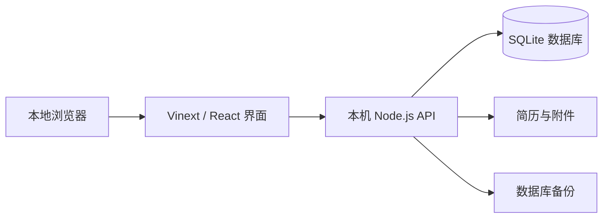

<p align="center">
  
</p>

<h1 align="center">秋招手账</h1>

<p align="center">一款本地优先的秋招投递、笔试、面试、日程与简历管理网页工具。</p>

<p align="center">
  
  
  
  
</p>

> 不只是记录“投了哪家公司”，还要完整保留每一场笔试、每一轮面试，以及当时问了什么、答了什么、哪里需要改进。

## 主要功能

### 投递总览

- 使用不同颜色区分准备投递、已投递、笔试、面试、Offer、拒绝和放弃。
- 紧凑彩色矩阵适合集中查看上百家企业。
- 支持按状态筛选、公司或岗位搜索、最近更新/公司名称/当前进度排序。
- 支持紧凑与舒展两种显示密度，点击企业即可编辑投递信息。

### 投递管理

- 记录公司、岗位、城市、渠道、投递日期、优先级、薪资、JD 链接和备注。
- 支持准备投递、已投递、笔试、面试、Offer、拒绝和放弃等状态。
- 投递表格可随时显示或隐藏薪资列，并记住上次选择。
- 状态为“拒绝”时，可选择初筛挂、笔试挂、测评挂、一面挂、二面挂或三面挂。
- 支持搜索、筛选、编辑、删除，以及展开查看岗位的完整招聘流程。
- 支持批量检查网申或 JD 链接，识别明确失效、招聘已关闭和需要人工复核的页面。

### 回收站

- 删除的投递会从总览、投递管理、招聘流程和日程中隐藏，并在回收站保留 30 天。
- 回收站支持完整恢复，也可以手动永久删除或一键清空。
- 超过 30 天的记录会自动永久删除；关联招聘流程、题目和附件随记录一并处理。

### 笔试与面试复盘

- 一个岗位可以添加多场笔试和多轮面试。
- 独立记录时间、时长、形式、地点或会议链接、面试官或部门。
- 记录进展、结果、综合评分、整体感受和改进方向。
- 每一道题可分别保存自己的回答、参考答案、标签和待复习标记。
- 支持为单场流程添加本机附件，单个附件最大 10 MB。

### 日程与简历

- 管理投递截止、宣讲会、结果提醒、准备任务和其他日程。
- 笔试与面试时间会自动出现在近期安排中。
- 集中保存 PDF、DOC 和 DOCX 简历，记录版本、方向、备注和上传时间。
- 单份简历最大 20 MB，可直接打开或删除。

### 数据复盘

- 展示准备投递、累计已投递、笔试场次、面试场次和 Offer 数量。
- 查看投递漏斗、渠道分布、近期投递和即将到来的日程。
- 岗位进入笔试或面试阶段后仍计入累计已投递，多轮面试按实际场次统计。

## 界面与交互

- 默认浅色模式，可切换深色模式。
- 侧边栏支持展开和收起。
- 所有数据操作都在本机完成，无需注册账号。
- 桌面“秋招手账网页版”快捷方式会静默启动本地服务并打开默认浏览器。

## 快速开始

### 环境要求

- Node.js `>=22.13.0 <23`
- npm
- Git
- Windows 10/11（项目自带的 VBS 快捷启动脚本面向 Windows）

### 获取代码

```powershell
git clone https://github.com/ahao224/AutumnRecruitmentTracker.git
cd AutumnRecruitmentTracker
npm install
```

### 设置数据目录

推荐在启动数据服务的 PowerShell 窗口中指定：

```powershell
$env:AUTUMN_DATA_DIR = "$env:USERPROFILE\Documents\秋招手账数据"
```

如果不设置，当前本地数据服务默认使用：

```text
D:\222
```

### 开发模式

第一个 PowerShell 窗口启动数据服务：

```powershell
npm run api
```

第二个 PowerShell 窗口启动网页开发服务：

```powershell
npm run dev:site
```

访问：<http://localhost:3000>

### 正式本地模式

先构建网页：

```powershell
npm run build
```

然后分别启动数据服务和正式网页服务：

```powershell
npm run api
```

```powershell
npm run start
```

## Windows 网页快捷启动

仓库包含以下本地启动脚本：

```text
启动秋招手账网页版.vbs
启动秋招手账.vbs
启动秋招手账.bat
```

使用前需要先完成：

```powershell
npm install
npm run build
```

之后运行 `启动秋招手账网页版.vbs`，脚本会：

1. 检查数据服务 `4311` 端口。
2. 检查网页服务 `3000` 端口。
3. 静默启动缺少的本地服务。
4. 在默认浏览器中打开秋招手账。

你也可以为该 VBS 文件创建桌面快捷方式，并使用 `public/favicon-arrow-v2.ico` 作为图标。

## 数据保存与隐私

应用没有账号系统，也不会主动上传求职信息。网页和数据接口仅在本机运行。

数据目录结构：

```text
秋招手账数据/
├─ data/
│  └─ autumn-recruitment.db   # SQLite 主数据库
├─ resumes/                    # 简历文件
├─ attachments/                # 笔试、面试附件
└─ backups/                    # 数据库备份
```

本项目会保存真实求职信息。提交代码到 GitHub 前，请勿把自己的数据库、简历、附件或备份加入仓库。

## 备份与迁移

在“数据与备份”页面可以：

- 创建带日期的 SQLite 数据库备份。
- 导出投递、流程、题目和日程等结构化记录为 JSON。
- 将 JSON 记录合并导入现有数据库。

JSON 不包含简历和附件的文件内容。完整迁移时应关闭网页服务，然后复制整个数据目录。

## 常用命令

| 命令 | 说明 |
| --- | --- |
| `npm run api` | 启动本地数据服务 |
| `npm run dev:site` | 启动网页开发服务 |
| `npm run build` | 生成正式网页构建 |
| `npm run start` | 启动正式网页服务 |
| `npm run lint` | 检查代码规范 |

## 项目结构

```text
AutumnRecruitmentTracker/
├─ app/
│  ├─ page.tsx                 # 主界面、投递总览与交互
│  ├─ globals.css              # 全局主题与组件样式
│  ├─ process-fixes.css        # 流程、侧栏和投递矩阵样式
│  └─ layout.tsx               # 页面元信息与图标
├─ server/
│  └─ local-api.mjs            # 本地 HTTP API、SQLite 与文件管理
├─ public/                     # 网页图标等静态资源
├─ vite.config.ts              # Vinext / Vite 配置
└─ package.json                # 依赖、版本与脚本
```

## 工作原理



- 网页端口：`3000`
- 数据接口端口：`4311`
- 服务仅绑定本机地址，不用于公网访问。

## 技术栈

- [React 19](https://react.dev/)
- [TypeScript](https://www.typescriptlang.org/)
- [Vinext](https://github.com/cloudflare/vinext)
- [Vite](https://vite.dev/)
- Node.js 内置 SQLite

## 常见问题

### 页面显示 `Failed to fetch` 或“数据服务未连接”

关闭旧页面，再从桌面的“秋招手账网页版”重新打开。如果从源码运行，请确认 `npm run api` 和网页服务都已启动。

### 端口 3000 或 4311 被占用

关闭旧的秋招手账服务后重试。网页启动脚本会复用已经正常运行的本项目服务。

### 代码更新后页面没有变化

执行 `npm run build`，关闭旧服务，再重新运行网页版快捷方式。必要时在浏览器中使用 `Ctrl + F5` 强制刷新。

### 迁移时只复制数据库够吗？

不够。数据库保存记录和文件元数据，简历与附件本体位于独立目录。完整迁移应复制整个数据目录。

## 参与项目

欢迎通过 [Issues](https://github.com/ahao224/AutumnRecruitmentTracker/issues) 提交问题和功能建议，也欢迎提交 Pull Request。

提交前建议执行：

```powershell
npm run lint
npm run build
```

## 许可证

本仓库目前尚未添加开源许可证。在许可证补充之前，默认不授予复制、修改或再分发代码的权利。

---

如果这个工具帮助你更有条理地度过秋招，欢迎点一个 Star。祝每一次准备都有回响，早日拿到心仪 Offer。
