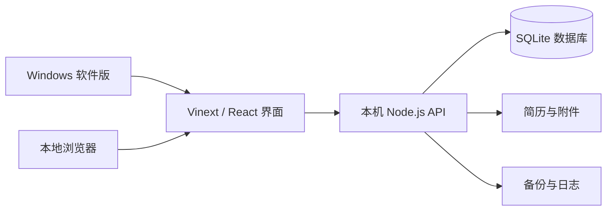

<p align="center">
  
</p>

<h1 align="center">秋招手账</h1>

<p align="center">
  一款本地优先的秋招投递、笔试、面试、日程与简历管理工具。
</p>

<p align="center">
  
  
  
  
</p>

> 不只是记录“投了哪家公司”，还要完整保留每一场笔试、每一轮面试，以及当时问了什么、答了什么、哪里需要改进。

## 目录

- [项目特点](#项目特点)
- [主要功能](#主要功能)
- [运行方式](#运行方式)
- [Windows 安装版](#windows-安装版)
- [数据保存与隐私](#数据保存与隐私)
- [备份与迁移](#备份与迁移)
- [从源码运行](#从源码运行)
- [构建 Windows 安装包](#构建-windows-安装包)
- [项目结构](#项目结构)
- [技术栈](#技术栈)
- [常见问题](#常见问题)
- [参与项目](#参与项目)
- [许可证](#许可证)

## 项目特点

- **本地优先**：不需要注册账号，核心数据、简历和附件保存在自己的电脑上。
- **完整招聘流程**：同一岗位可以记录笔试、测评、技术一面、二面、三面、HR 面和自定义轮次。
- **逐场复盘**：每场笔试或面试都有独立时间、结果、评分、题目、回答、参考答案和改进记录。
- **累计数据不清零**：岗位进入笔试或面试阶段后，仍计入累计已投递；多轮面试按实际场次统计。
- **双入口**：既可使用 Windows 独立软件，也可在本机浏览器中打开。
- **深浅主题**：默认浅色，可手动切换深色模式并记住选择。

## 主要功能

### 投递管理

- 记录公司、岗位、城市、渠道、投递日期、优先级、薪资、JD 链接和备注。
- 支持准备投递、已投递、笔试、面试、Offer、拒绝和放弃等状态。
- 状态为“拒绝”时，可继续选择：初筛挂、笔试挂、测评挂、一面挂、二面挂或三面挂。
- 支持搜索、状态筛选、编辑、删除和展开岗位招聘流程。

### 笔试与面试复盘

- 一个岗位可添加多场笔试和多轮面试。
- 独立记录计划时间、时长、形式、地点或会议链接、面试官或部门。
- 记录进展、结果、综合评分、整体感受和改进方向。
- 每一道题可以分别保存自己的回答、参考答案、标签和待复习标记。
- 支持为单场流程添加本机附件，单个附件最大 10 MB。

### 日程

- 管理投递截止、宣讲会、结果提醒、准备任务和其他日程。
- 可选择关联已有岗位，保存地点、链接、提醒时间和备注。
- 笔试与面试时间会一并出现在近期安排中。

### 简历库

- 集中保存 PDF、DOC 和 DOCX 简历，单个文件最大 20 MB。
- 记录简历名称、版本、目标方向、备注和上传时间。
- 支持直接打开或删除本机简历。

### 数据复盘

- 展示准备投递、累计已投递、笔试场次、面试场次和 Offer 数量。
- 查看投递漏斗、渠道分布、近期投递和即将到来的日程。

## 运行方式

| 方式 | 适合场景 | 是否需要 Node.js | 数据位置 |
| --- | --- | --- | --- |
| Windows 软件版 | 日常使用、分享给非开发用户 | 安装后不需要 | 默认位于用户“文档”目录 |
| 本地网页版 | 开发、调试或习惯使用浏览器 | 需要 Node.js 22 | 由 `AUTUMN_DATA_DIR` 指定 |

两种方式使用同一数据目录时，会读取同一套投递、流程、日程和简历数据。软件版与网页版也可以同时打开，应用会复用已经运行的本地服务。

## Windows 安装版

1. 在仓库的 [Releases](https://github.com/ahao224/AutumnRecruitmentTracker/releases) 页面下载最新安装程序。
2. 双击 `秋招手账-x.x.x-安装版.exe`。
3. 安装完成后，从桌面的“秋招手账”快捷方式启动。

安装版会安装到当前 Windows 用户的本地应用目录，例如：

```text
C:\Users\<用户名>\AppData\Local\AutumnRecruitmentTracker
```

程序安装位置与数据保存位置相互独立。升级或卸载程序时，不会主动删除数据目录。

> 当前安装程序未进行商业代码签名，Windows SmartScreen 可能显示风险提醒。请只从本仓库 Releases 下载，确认发布者和文件来源后再运行。

### 发布者注意

Windows 安装包体积较大，不要直接提交到普通 Git 历史。请在 GitHub 中创建 Release，并把安装程序作为 Release 附件上传。

## 数据保存与隐私

应用没有账号系统，也不会主动把求职信息上传到远程服务器。页面和数据接口只监听本机地址。

安装版按以下优先级选择数据目录：

1. 环境变量 `AUTUMN_DATA_DIR` 指定的目录。
2. 如果发现旧版数据库 `D:\222\data\autumn-recruitment.db`，继续使用 `D:\222`，避免旧数据丢失。
3. 其他电脑默认使用：

```text
C:\Users\<用户名>\Documents\秋招手账数据
```

数据目录结构：

```text
秋招手账数据/
├─ data/
│  └─ autumn-recruitment.db   # SQLite 主数据库
├─ resumes/                    # 简历文件
├─ attachments/                # 笔试、面试附件
├─ backups/                    # 数据库备份
└─ logs/                       # 桌面版诊断日志
```

本项目会保存真实求职信息。提交代码到 GitHub 前，请勿把自己的数据库、简历、附件、备份或日志加入仓库。

## 备份与迁移

在“数据与备份”页面可以：

- 创建带日期的 SQLite 数据库备份。
- 导出结构化记录为 JSON。
- 将 JSON 记录合并导入现有数据库。

JSON 适合迁移投递、招聘流程、题目和日程等结构化记录，但不包含简历和附件的文件内容。

如需完整迁移到另一台电脑：

1. 关闭秋招手账。
2. 复制整个数据目录，而不只是数据库文件。
3. 在新电脑上将 `AUTUMN_DATA_DIR` 指向该目录，或把内容复制到默认的“文档\秋招手账数据”。
4. 重新打开应用并检查记录、简历和附件。

## 从源码运行

### 环境要求

- Windows 10 或 Windows 11
- Node.js `>=22.13.0 <23`
- npm
- Git

建议使用 Node.js 22。项目的安装器构建流程未针对 Node.js 24 验证。

### 1. 获取代码

```powershell
git clone https://github.com/ahao224/AutumnRecruitmentTracker.git
cd AutumnRecruitmentTracker
npm install
```

### 2. 设置开发数据目录

在启动数据服务的 PowerShell 窗口中执行：

```powershell
$env:AUTUMN_DATA_DIR = "$env:USERPROFILE\Documents\秋招手账数据"
```

如果不设置该变量，源码中的本地数据服务默认使用 `D:\222`。

### 3. 启动数据服务

```powershell
npm run api
```

数据接口默认运行在：`http://127.0.0.1:4311`

### 4. 启动网页开发服务

另开一个 PowerShell 窗口：

```powershell
npm run dev:site
```

然后访问：`http://localhost:3000`

### 5. 启动桌面开发版

桌面进程使用正式构建产物，因此先执行：

```powershell
npm run build
npm run desktop
```

## 构建 Windows 安装包

请使用 Node.js 22：

```powershell
npm install
npm run package:win
```

构建完成后，安装程序位于：

```text
out/make/squirrel.windows/x64/AutumnRecruitmentTracker-Setup.exe
```

打包配置位于 `forge.config.cjs`，当前生成 Windows x64 Squirrel 安装程序。

## 常用命令

| 命令 | 说明 |
| --- | --- |
| `npm run api` | 启动本地数据服务 |
| `npm run dev:site` | 启动网页开发服务 |
| `npm run build` | 生成正式网页构建 |
| `npm run start` | 启动正式网页服务 |
| `npm run desktop` | 启动 Electron 桌面开发版 |
| `npm run package:win` | 构建 Windows x64 安装程序 |
| `npm run lint` | 检查代码规范 |

## 项目结构

```text
AutumnRecruitmentTracker/
├─ app/
│  ├─ page.tsx                 # 主界面与交互
│  ├─ globals.css              # 全局主题与组件样式
│  ├─ process-fixes.css        # 招聘流程与侧栏补充样式
│  └─ layout.tsx               # 页面元信息与图标
├─ server/
│  └─ local-api.mjs            # 本地 HTTP API、SQLite 与文件管理
├─ electron/
│  └─ main.cjs                 # Windows 桌面版主进程
├─ assets/                     # 安装程序和桌面应用图标
├─ public/                     # 网页图标等静态资源
├─ forge.config.cjs            # Electron Forge 打包配置
├─ vite.config.ts              # Vinext / Vite 配置
└─ package.json                # 依赖、版本与脚本
```

## 工作原理



- 界面端口：`3000`
- 数据接口端口：`4311`
- 服务仅绑定本机地址，不用于公网部署。

## 技术栈

- [React 19](https://react.dev/)
- [TypeScript](https://www.typescriptlang.org/)
- [Vinext](https://github.com/cloudflare/vinext)
- [Vite](https://vite.dev/)
- [Electron](https://www.electronjs.org/)
- [Electron Forge](https://www.electronforge.io/)
- Node.js 内置 SQLite

## 常见问题

### 页面显示 `Failed to fetch` 或“数据服务未连接”

关闭旧浏览器页面，再从桌面重新打开“秋招手账”或“秋招手账网页版”。如果从源码运行，请确认数据服务和网页服务都已启动。

### 端口 3000 或 4311 被占用

先关闭其他秋招手账窗口和旧的开发服务，再重新启动。桌面版与本项目的网页版会自动复用已识别的服务。

### 升级软件会丢失数据吗？

正常升级不会删除独立的数据目录。进行重要升级或迁移前，仍建议先在“数据与备份”页面创建备份。

### 为什么 GitHub 仓库里没有安装程序？

安装程序应上传到 GitHub Releases，而不是提交到源码目录。源码仓库通过 `.gitignore` 排除了 `out/` 构建产物。

### 能在 macOS 或 Linux 上使用吗？

当前安装与桌面启动流程仅针对 Windows x64。前端和本地 API 使用跨平台技术，但尚未提供其他平台安装包。

## 参与项目

欢迎通过 [Issues](https://github.com/ahao224/AutumnRecruitmentTracker/issues) 提交问题和功能建议，也欢迎提交 Pull Request。

提交前建议至少执行：

```powershell
npm run lint
npm run build
```

## 许可证

本仓库目前尚未添加开源许可证。在许可证补充之前，默认不授予复制、修改或再分发代码的权利。如计划公开协作或允许他人二次开发，建议添加合适的 `LICENSE` 文件。

---

如果这个工具帮助你更有条理地度过秋招，欢迎点一个 Star。祝每一次准备都有回响，早日拿到心仪 Offer。
