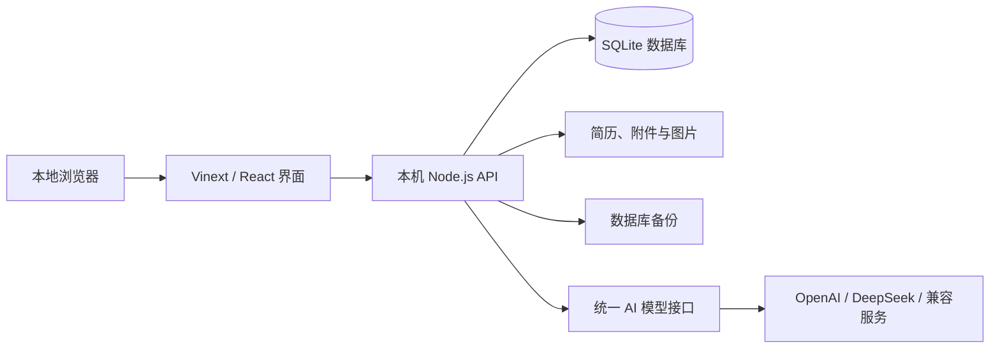

<p align="center">
  
</p>

<h1 align="center">秋招手账</h1>

<p align="center">一款本地优先的秋招投递、招聘流程、日程、简历与 AI 求职管理工具。</p>

<p align="center">
  <a href="https://github.com/ahao224/AutumnRecruitmentTracker"></a>
  
  
  
  
</p>

> 不只记录“投了哪家公司”，也完整保留每一场笔试、每一轮面试、当时问了什么、答了什么，以及下一次如何做得更好。

## 功能概览

### 投递总览

- 使用不同颜色区分准备投递、已投递、进入人才库、笔试、面试、OC、Offer、拒绝和放弃。
- 拒绝记录使用淡红色，放弃记录使用独立颜色，密集数据也能快速识别。
- 支持状态筛选、公司或岗位搜索、显示密度切换，并默认按当前进度排列。
- 一键导出 Excel，包含公司、岗位、投递日期、当前进度，以及每家公司每轮流程与日期。
- 点击企业可直接进入编辑；没有“直达”按钮的记录仍保持操作区对齐。

### 投递管理

- 记录公司、岗位、城市、渠道、投递日期、优先级、薪资、网申或 JD 链接、简历版本与备注。
- 支持准备投递、已投递、进入人才库、笔试、面试、OC、Offer、拒绝和放弃等状态。
- 拒绝时可记录初筛挂、业务筛选挂、笔试挂、测评挂、一面挂、二面挂或三面挂。
- 支持搜索、筛选、进度排序、薪资列显隐、编辑、删除和展开完整招聘流程。
- 支持批量检查网申或 JD 链接，识别明确失效、招聘关闭和需要人工复核的页面。
- 备注支持选择、拖入或直接粘贴 PNG、JPG、WebP、GIF 图片，单张最大 10 MB。
- 点击备注图片可在当前页面放大预览，无需打开新标签页；支持遮罩、关闭按钮和 `Esc` 关闭。

### 招聘流程与题目复盘

- 一个岗位可记录多场笔试、测评、AI 面试和多轮人工面试。
- 独立保存轮次、计划时间、时长、形式、地点或会议链接、面试官或部门、结果和评分。
- 添加笔试或面试流程后，岗位当前状态会按规则自动推进；手动设置的终态不会被覆盖。
- 当“计划时间 + 时长”结束且结果仍为“待进行”时，系统自动更新为“已完成（待结果）”。
- 每道题可记录问题、自己的回答、参考答案、标签和待复习标记。
- 支持题目上移，并将“添加下一道题目”放在题目列表底部，连续录入更顺手。
- 每道题均可粘贴或选择图片；图片与题目绑定，题目调整顺序后不会错位。
- 题目图片支持当前页面放大预览、删除和本地保存。
- 每轮流程可一键导出 PDF，包含公司、岗位、轮次、时间、结果、题目、回答、参考答案、题目图片和整体复盘。
- PDF 中图片会跟随对应题目，自动等比缩放、居中和分页。
- 单场流程还可添加通用本机附件，单个文件最大 10 MB。

### 日程与简历

- 管理投递截止、宣讲会、结果提醒、准备任务和其他日程。
- 笔试与面试会自动进入日程；待进行项目优先于已完成项目，同类按日期从新到旧排列。
- 已完成与待进行日程使用更明显的字重和对比度区分。
- 集中保存 PDF、DOC 和 DOCX 简历，记录版本、目标方向、备注和上传时间。
- 第一份简历自动成为默认简历，也可以随时切换；删除默认简历后会自动选择最近更新的一份。
- 新增投递时若“简历版本”为空，AI 分析会自动使用默认简历；手动选择始终优先。
- 单份简历最大 20 MB，可直接打开或删除。

### 数据复盘

- 展示从已投递、笔试、面试、OC 到 Offer 的转化漏斗。
- 汇总招聘流程数量、累计题目、已有结果和投递渠道。
- 提供“笔面试复盘”卡片，显示公司、轮次、岗位、日期、结果、题目数、评分和复盘摘要。
- 复盘卡片按日期从新到旧排列，点击可直接打开原始流程详情。
- 默认隐藏没有记录题目的笔面试，可通过按钮临时显示。
- “渠道分布”位于笔面试复盘之后，优先呈现更有价值的复盘内容。

### AI 岗位分析与求职助手

- 在“数据与备份”中统一配置提供商、模型、接口地址和 API Key。
- 支持 OpenAI Responses API，以及 DeepSeek 等使用 Chat Completions 的 OpenAI 兼容接口。
- 新增或编辑投递时，可读取岗位 JD 和选定简历，输出岗位概述、匹配判断、核心技能、主要职责、简历建议、面试方向与准备清单。
- 没有指定简历时自动读取默认简历；支持 PDF 和 DOCX，旧版 `.doc` 建议先另存为 PDF 或 DOCX。
- 独立 AI 助手支持多轮对话，可关联岗位和简历，并读取对应 JD、投递状态、招聘流程、面试题目与复盘。
- AI 会话保存在本地 SQLite，可新建、重命名、删除，并可收起本地会话侧栏。
- 内置岗位匹配、模拟面试、面试复盘和今日计划四个快捷提问。
- 四个快捷提问均可自定义按钮名称和完整问题，设置保存在浏览器本地，并支持一键恢复默认。
- 回答会标注实际使用的本地资料；AI 只提供建议，不会自动修改投递、日程或流程数据。

## DeepSeek 配置示例

在“数据与备份 → AI 模型接口”中填写：

| 配置项 | 建议值 |
| --- | --- |
| 提供商 | OpenAI 兼容接口 |
| 模型名称 | `deepseek-chat` |
| 接口地址 | `https://api.deepseek.com` |
| API Key | 你的 DeepSeek API Key |

保存后点击“测试连接”。为了避免密钥从后端返回到网页，保存成功后 API Key 输入框会清空并显示“已保存；留空表示不修改”，这是正常的安全设计。

也可以通过环境变量配置，环境变量优先于本地配置文件：

```powershell
$env:AUTUMN_AI_PROVIDER = "openai-compatible"
$env:AUTUMN_AI_MODEL = "deepseek-chat"
$env:AUTUMN_AI_BASE_URL = "https://api.deepseek.com"
$env:AUTUMN_AI_API_KEY = "你的 API Key"
```

## 界面与交互

- 默认浅色主题，可切换深色主题。
- 侧边栏支持展开和收起，并记住上次状态。
- 浅色模式下的复盘卡片、题目与回答区域使用更高对比度设计。
- 题目图片和投递备注图片均在当前页面预览，不会跳转到其他浏览器页面。
- 所有核心数据操作均在本机完成，无需注册账号。
- Windows 快捷启动脚本可静默启动本地服务并打开默认浏览器。

## 快速开始

### 环境要求

- Node.js `>=22.13.0 <23`
- npm
- Git
- Windows 10/11（仓库内的 VBS 与 BAT 快捷启动脚本面向 Windows）

### 获取代码

```powershell
git clone https://github.com/ahao224/AutumnRecruitmentTracker.git
cd AutumnRecruitmentTracker
npm install
```

### 设置数据目录

推荐在启动前指定自己的数据目录：

```powershell
$env:AUTUMN_DATA_DIR = "$env:USERPROFILE\Documents\秋招手账数据"
```

如果不设置，当前版本默认使用：

```text
D:\222
```

也可以修改本地 API 端口：

```powershell
$env:AUTUMN_API_PORT = "4311"
```

### 开发模式

同时启动本地 API 与网页开发服务：

```powershell
npm run dev
```

也可以分别启动：

```powershell
npm run api
npm run dev:site
```

访问：<http://localhost:3000>

### 正式本地模式

```powershell
npm run build
npm run api
```

在另一个终端运行：

```powershell
npm run start
```

## Windows 快捷启动

仓库包含：

```text
启动秋招手账网页版.vbs
启动秋招手账.vbs
启动秋招手账.bat
```

首次使用前执行：

```powershell
npm install
npm run build
```

之后运行 `启动秋招手账网页版.vbs`，脚本会检查 `4311` 和 `3000` 端口，静默启动缺少的服务并打开网页。也可以为它创建桌面快捷方式，并使用 `public/favicon-arrow-v2.ico` 作为图标。

## 本地数据与隐私

应用没有账号系统，核心求职数据不会主动上传。只有在你主动使用 AI 分析或 AI 对话时，相关问题以及所选岗位、简历和复盘上下文才会发送给已配置的模型服务。

默认数据目录结构：

```text
D:\222\
├─ data\
│  ├─ autumn-recruitment.db   # 投递、流程、题目、日程和 AI 对话
│  └─ ai-config.json          # AI 配置，可能包含明文 API Key
├─ resumes\                   # 上传的简历文件
├─ attachments\               # 流程附件、题目图片和投递备注图片
└─ backups\                   # SQLite 数据库备份
```

请勿将真实数据库、简历、附件、截图、备份或 `ai-config.json` 提交到 GitHub。`ai-config.json` 中的 API Key 以明文保存在本机，应妥善保护。

## 备份与迁移

“数据与备份”页面支持：

- 创建带日期的 SQLite 数据库备份。
- 导出投递、流程、题目、日程和 AI 会话等结构化记录为 JSON。
- 将 JSON 记录合并导入现有数据库。

JSON 不包含简历、附件和图片文件本体。完整迁移时，请先关闭服务，再复制整个数据目录。

## 常用命令

| 命令 | 说明 |
| --- | --- |
| `npm run dev` | 同时启动本地 API 与网页开发服务 |
| `npm run api` | 启动本地数据服务 |
| `npm run dev:site` | 仅启动网页开发服务 |
| `npm run build` | 生成正式网页构建 |
| `npm run start` | 启动正式网页服务 |
| `npm run lint` | 检查代码规范 |

## 项目结构

```text
AutumnRecruitmentTracker/
├─ app/
│  ├─ page.tsx                 # 主界面与交互
│  ├─ globals.css              # 全局主题与基础样式
│  ├─ process-fixes.css        # 流程、AI、图片预览等扩展样式
│  └─ layout.tsx               # 页面元信息与图标
├─ server/
│  ├─ ai/
│  │  └─ model-client.mjs      # OpenAI 与兼容模型适配器
│  ├─ local-api.mjs            # 本地 API、SQLite、导出和文件管理
│  └─ resume-text.mjs          # PDF、DOCX 简历文字解析
├─ scripts/
│  └─ dev.mjs                  # 同时启动 API 与开发网页
├─ public/                     # 网页图标等静态资源
├─ tests/                      # 页面测试
├─ vite.config.ts              # Vinext / Vite 配置
└─ package.json                # 依赖、版本与脚本
```

## 工作原理


```mermaid
flowchart LR
    A[本地浏览器] --> B[Vinext / React 界面]
    B --> C[本机 Node.js API]
    C --> D[(SQLite 数据库)]
    C --> E[简历、附件与图片]
    C --> F[数据库备份]
    C --> G[统一 AI 模型接口]
    G --> H[OpenAI / DeepSeek / 兼容服务]
```

- 网页端口：`3000`
- 本地 API 端口：`4311`
- 两个服务均用于本机访问，不应直接暴露到公网。

## 技术栈

- [React 19](https://react.dev/) + TypeScript
- [Vinext](https://github.com/cloudflare/vinext) + [Vite](https://vite.dev/)
- Node.js 内置 SQLite
- PDFKit + Sharp（PDF 与图片处理）
- ExcelJS（投递数据导出）
- Mammoth + pdf-parse（简历文字解析）

## 常见问题

### 页面显示 `Failed to fetch` 或“数据服务未连接”

确认 `npm run api` 正在运行。如果使用快捷启动方式，关闭旧页面后重新运行“秋招手账网页版”。

### 端口 3000 或 4311 被占用

关闭旧的秋招手账服务后重试。Windows 快捷启动脚本会复用已经正常运行的本项目服务。

### 代码更新后页面没有变化

重新执行 `npm run build`，关闭旧网页服务，再运行 `npm run start`。浏览器中可使用 `Ctrl + F5` 强制刷新。

### 保存 AI 配置后 API Key 输入框为什么变空？

这是预期行为。密钥已保存在本机，但后端不会把它返回给网页。留空再次保存表示保留现有密钥。

### 图片保存在哪里？

题目图片、投递备注图片和流程附件保存在数据目录的 `attachments` 中；数据库只保存文件元数据和关联关系。

### 为什么图片没有出现在 PDF 中？

请先保存招聘流程再导出。当前版本导出时会自动保存编辑内容和待上传的题目图片，并将图片放在对应题目下方。

### 迁移时只复制数据库够吗？

不够。数据库保存记录和文件元数据，文件本体位于 `resumes` 与 `attachments`。完整迁移应复制整个数据目录。

## 参与项目

欢迎通过 [Issues](https://github.com/ahao224/AutumnRecruitmentTracker/issues) 提交问题和功能建议，也欢迎提交 Pull Request。

提交前建议执行：

```powershell
npm run lint
npm run build
```

## 许可证

本仓库目前尚未添加开源许可证。在许可证补充之前，默认不授予复制、修改或再分发代码的权利。

---

如果这个工具帮助你更有条理地度过秋招，欢迎点一个 Star。祝每一次准备都有回响，早日拿到心仪 Offer。
